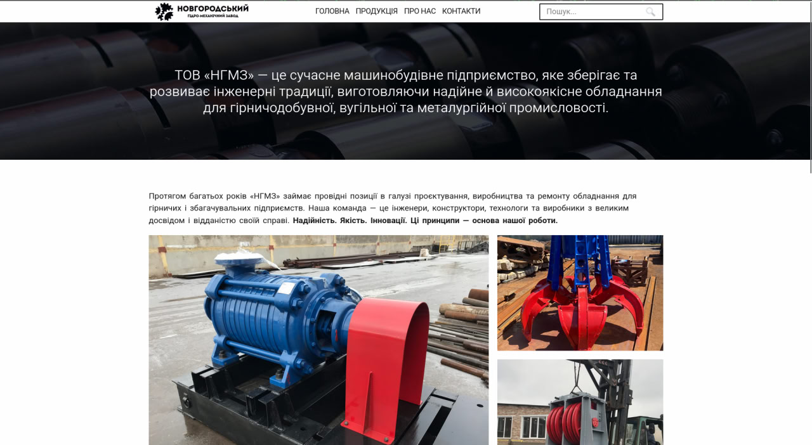
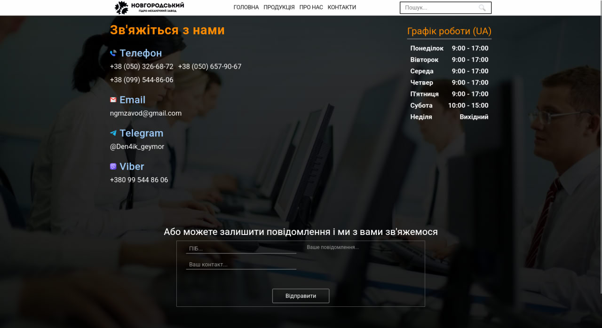

# Website for NGMZ factory.
### Made to order for Новгородский гидро-механический завод. Supports localization in two languages — Ukrainian and English, adapted for displays from 350px up to 2000+ pixels.
#### All photos are provided by LLC "Novhorod Hydro-Mechanical Plant". All rights reserved.

  
  
  
  
  

#### Tech stack:
- Python 3.12 [main programming language]
- Django 5.2  [web framework] 
- MVT architecture [django standart]
- Aiogram 3.20 [for comminucation via Telegram]
- django-modeltranslation 0.19 [for localization]

You can find actual working version on <a href="http://ngmzhydro.com">http://ngmzhydro.com</a>. (link may be changed)
